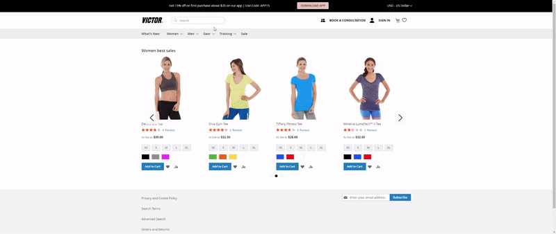

<h1 align="center">McFadyen Assignment - Magento</h1>

Customizations using Magento

<h1 align="left">🎯 Objectives </h1>

- Customize Header
- Create a product Carousel
- Use a custom text to display product information on listing page
- Responsive and translatable theme

<h1 align="left">Result </h1>

  

